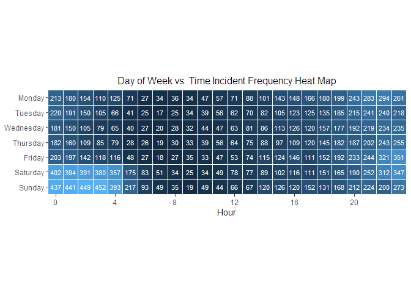

NYPD Shooting Incident Data Project
================
W. Jencyowski

## Data Import

``` r
# NYPD Shooting Incident Data (Historic) from www.catalog.data.gov
nypd_url <- "https://data.cityofnewyork.us/api/v3/views/833y-fsy8/export.csv?accessType=DOWNLOAD"
nypd_raw <- read_csv(nypd_url)
```

    ## Rows: 29744 Columns: 21
    ## ── Column specification ────────────────────────────────────────────────────────────────────────────────────
    ## Delimiter: ","
    ## chr  (12): OCCUR_DATE, BORO, LOC_OF_OCCUR_DESC, LOC_CLASSFCTN_DESC, LOCATION...
    ## dbl   (5): INCIDENT_KEY, PRECINCT, JURISDICTION_CODE, Latitude, Longitude
    ## num   (2): X_COORD_CD, Y_COORD_CD
    ## lgl   (1): STATISTICAL_MURDER_FLAG
    ## time  (1): OCCUR_TIME
    ## 
    ## ℹ Use `spec()` to retrieve the full column specification for this data.
    ## ℹ Specify the column types or set `show_col_types = FALSE` to quiet this message.

## Tidying

### Renaming cloumns for clarity

``` r
nypd <- nypd_raw |> 
    rename(
        Key = INCIDENT_KEY,
        Date = OCCUR_DATE,
        Time = OCCUR_TIME,
        Boro = BORO,
        Precinct = PRECINCT,
        Location = LOC_CLASSFCTN_DESC,
        Location_description = LOCATION_DESC,
        Murder = STATISTICAL_MURDER_FLAG,
        Perp_age = PERP_AGE_GROUP,
        Perp_sex = PERP_SEX,
        Perp_race = PERP_RACE,
        Vic_age = VIC_AGE_GROUP,
        Vic_race = VIC_RACE,
        Vic_sex = VIC_SEX,
        )
```

### Refactoring using the dataset footnotes

``` r
nypd$Key <- as.integer(nypd$Key)
nypd$Date <- as.Date(nypd$Date, "%m/%d/%Y")
# OCCUR_TIME is already is already hr/min/sec
nypd$Boro <- as.factor(nypd$Boro)
nypd$Precinct <- as.integer(nypd$Precinct)
nypd$Location <- as.factor(nypd$Location)
nypd$Location_description <- as.factor(nypd$Location_description)
```

### Cleaning perp and victim demographics

##### This next section cleans the age, sex, and race columns using the naniar library, specifically the `replace_with_na` function.

#### Finding Perp demographic outliers

``` r
# Using the `unique()` command  to find each demegraphic that doesn't fit into the established convention
unique(nypd$Perp_age)
```

    ##  [1] "25-44"   "45-64"   "(null)"  "18-24"   "<18"     "65+"     "2021"   
    ##  [8] "1028"    NA        "UNKNOWN" "1020"    "940"     "224"

``` r
unique(nypd$Perp_sex)
```

    ## [1] "M"      "(null)" "F"      "U"      NA

``` r
unique(nypd$Perp_race)
```

    ## [1] "BLACK"                          "(null)"                        
    ## [3] "BLACK HISPANIC"                 "WHITE HISPANIC"                
    ## [5] "ASIAN / PACIFIC ISLANDER"       "UNKNOWN"                       
    ## [7] "WHITE"                          NA                              
    ## [9] "AMERICAN INDIAN/ALASKAN NATIVE"

#### Replacing Perp demographic outlier values with NA

``` r
# entries in each column that don't match convention. Unknowns are changed to NA for uniformity across the data set
perp_age_filter <- c("(null)", "2021", "1028", "UNKNOWN", "1020", "940", "224")
perp_sex_filter <- c("(null)", "U")
perp_race_filter <- c("(null)", "UNKNOWN")

# replacing those values with NA
nypd <- nypd |> 
    replace_with_na(replace = list(Perp_age = perp_age_filter,
                                   Perp_sex = perp_sex_filter,
                                   Perp_race = perp_race_filter)) 
```

#### Finding Victim demographic outliers

``` r
# the same process as above is done for the victims
unique(nypd$Vic_age)
```

    ## [1] "18-24"   "25-44"   "45-64"   "<18"     "65+"     "UNKNOWN" "1022"

``` r
unique(nypd$Vic_sex)
```

    ## [1] "M" "F" "U"

``` r
unique(nypd$Vic_race)
```

    ## [1] "BLACK"                          "WHITE"                         
    ## [3] "WHITE HISPANIC"                 "BLACK HISPANIC"                
    ## [5] "ASIAN / PACIFIC ISLANDER"       "UNKNOWN"                       
    ## [7] "AMERICAN INDIAN/ALASKAN NATIVE"

#### Replacing Victim demographic outlier values with NA

``` r
# creating a list of strings from each column that doesn't match convention
# unknowns are changed to NA for uniformity across the data set
vic_age_filter <- c("UNKNOWN", "1022")
vic_sex_filter <- c("U")
vic_race_filter <- c("UNKNOWN")

# replacing those values with NA
nypd <- nypd |> 
    replace_with_na(replace = list(Vic_age = vic_age_filter,
                                   Vic_sex = vic_sex_filter,
                                   Vic_race = vic_race_filter)) 
```

#### Mutating age demographics to ordered factors

``` r
nypd <- nypd |> 
    mutate(Perp_age = factor(Perp_age, levels = c("<18", "18-24", "25-44", "45-64", "65+")),
          Vic_age = factor(Vic_age, levels = c("<18", "18-24", "25-44", "45-64", "65+"))
    )
```

``` r
race <-  nypd |>
    select(Key, Date, Boro, Perp_race, Vic_race) |> 
    mutate(Vic_race_ord = fct_infreq(Vic_race))
```

## Victim Race Bar Plots

#### The two bar plots compare each Boro and the differences in a victim’s race. The first plot shows the count of all victims, separated by race, for all Boros. The second plot shows the proportion of victim race within each Boro.

### Victim frequency by Boro and race

``` r
ggplot(race, aes(x = Boro, fill = Vic_race_ord)) +
    geom_bar(position = "dodge") +
    scale_fill_discrete(labels = function(x) stringr::str_wrap(x, width = 12)) +
    theme(legend.position = "right",
          legend.key.spacing.y = unit(0.5, "cm"),
          plot.title = element_text(hjust = 0.5)) +
    labs(title = "Victim race frequency within each Boro",
         y = "Incidents", 
         fill = "Victim Race")
```

\<!-- -->

### Proportion of victim race within each Boro

``` r
ggplot(race, aes(x = Boro, fill = Vic_race_ord)) +
    geom_bar(position = "fill") +
    scale_fill_discrete(labels = function(x) stringr::str_wrap(x, width = 12)) +
    theme(legend.position = "right",
          legend.key.spacing.y = unit(0.5, "cm"),
          plot.title = element_text(hjust = 0.5)) +
    labs(title = "Victim race proportion within each Boro",
         y = "Proportion", 
         fill = "Victim Race")
```

\<!-- -->

## Day of Week vs. Time Incident Frequency Heat Map

``` r
# need to add a new column that contains the day of the week
# creating a new df to work with. selecting the Key and Date. The heat map will compares incidents time of occurence vs the day of the week. The key is needed to ensure each incident only gets counted once and not twice or more if there were two or more victims
dow_heat <- nypd |> 
    select(Key, Date, Time) |> 
    mutate(
        Weekday = weekdays(Date),
        Weekday = factor(Weekday, levels = c("Monday", "Tuesday", "Wednesday", "Thursday",
                                             "Friday", "Saturday", "Sunday")),
        Hour = hour(Time),
    ) |>
    
    # counting each incident as once occurence instead of how many victims there were
    distinct(Key, Weekday, Hour, .keep_all = TRUE) |>
    count(Weekday, Hour, name = "Incidents")
```

``` r
# using geom tile to create heat map of day of week vs time of shooting
ggplot(dow_heat, aes(x = Hour, y = fct_rev(Weekday), fill = Incidents)) +
    geom_tile(color = "white", lwd = 0.1, linetype = 1) +
    geom_text(aes(label = Incidents), color = "white", size = 3) +            
    scale_x_continuous(breaks = c(0, 4, 8, 12, 16, 20),
                     expand = c(0, 0)) +
    scale_y_discrete(expand = c(0,0)) +
    coord_fixed(ratio = 1) +
    labs(y = NULL, title = "Day of Week vs. Time Incident Frequency Heat Map") +
    theme(axis.text.y = element_text(vjust = 0.5),
          #axis.text.x = element_text(size = 12),
          panel.background = element_blank(),
          plot.background = element_blank(),
          plot.title = element_text(size = 12, hjust = 0.5),
          legend.position = "none")
```


